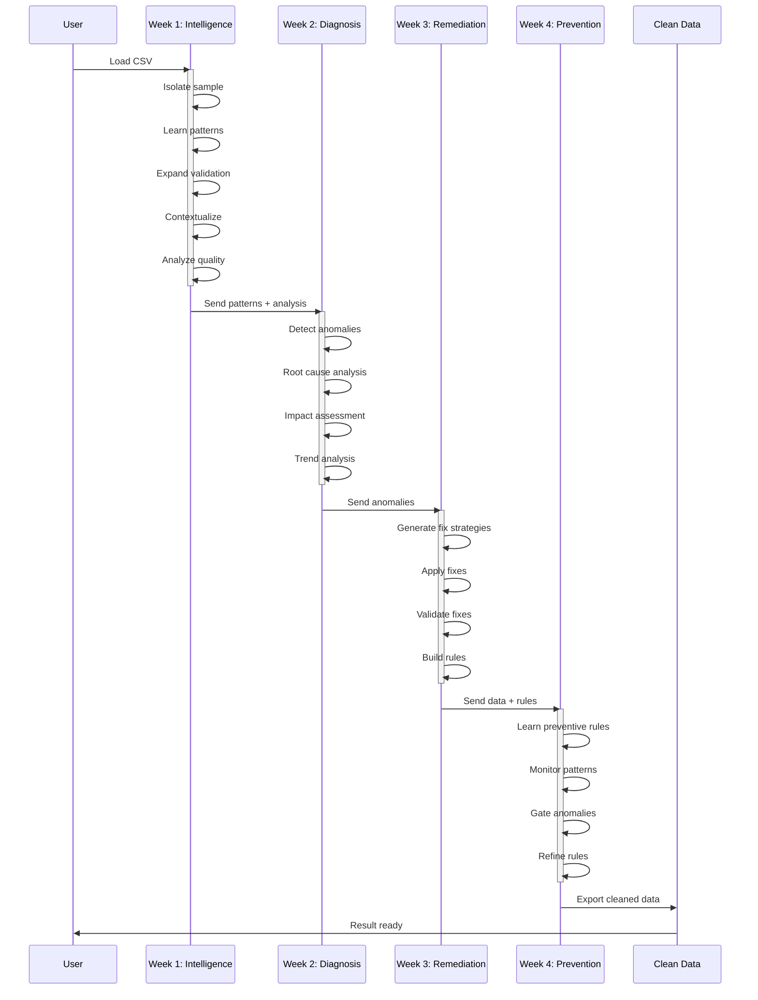
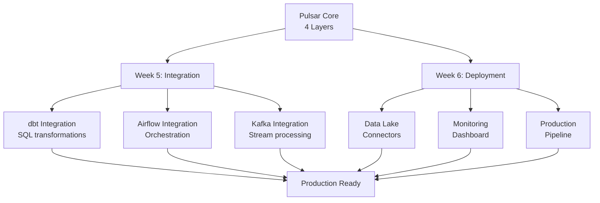

# Pulsar 2.0 Workflow

## Complete Data Quality Pipeline

```mermaid
graph TD
    A["📥 Load Data<br/>(CSV/Parquet)"] --> B["Week 1: INTELLIGENCE<br/>Small World Framework"]
    
    B --> B1["1️⃣ Isolator<br/>Sample 10%"]
    B1 --> B2["2️⃣ Learner<br/>Discover Patterns"]
    B2 --> B3["3️⃣ Expander<br/>Validate Full Dataset"]
    B3 --> B4["4️⃣ Contextualizer<br/>Infer Context"]
    B4 --> B5["5️⃣ Analyzer<br/>Quality Score"]
    
    B5 --> C["Week 2: DIAGNOSIS<br/>Root Cause Analysis"]
    
    C --> C1["🔍 Anomaly Detector<br/>Find Issues"]
    C1 --> C2["🎯 Root Cause Analyzer<br/>Why it happened"]
    C2 --> C3["💥 Impact Assessor<br/>How bad is it"]
    C3 --> C4["📊 Trend Analyzer<br/>When will it recur"]
    
    C4 --> D["Week 3: REMEDIATION<br/>Auto-Fix Issues"]
    
    D --> D1["💡 Strategy Generator<br/>Generate fixes"]
    D1 --> D2["🔧 Auto Fixer<br/>Apply fixes"]
    D2 --> D3["✓ Fix Validator<br/>Is fix safe?"]
    D3 --> D4["📋 Rule Builder<br/>Save reusable rules"]
    
    D4 --> E["Week 4: PREVENTION<br/>Continuous Learning"]
    
    E --> E1["📚 Rule Learner<br/>Learn preventive rules"]
    E1 --> E2["👁️ Pattern Monitor<br/>Track drift"]
    E2 --> E3["🚪 Anomaly Gater<br/>Prevent cascades"]
    E3 --> E4["⚙️ Rule Refiner<br/>Improve rules"]
    
    E4 --> F["✅ Clean Data<br/>Ready for Analytics"]
    
    style A fill:#e1f5ff
    style B fill:#fff3e0
    style C fill:#f3e5f5
    style D fill:#e8f5e9
    style E fill:#fce4ec
    style F fill:#c8e6c9
```



## Detailed Method Calls

```mermaid
graph LR
    subgraph "Week 1: Intelligence"
        I1["isolator.extract(df)"] --> I2["learner.learn(sample)"]
        I2 --> I3["expander.expand(df, patterns)"]
        I3 --> I4["contextualizer.contextualize(df, patterns)"]
        I4 --> I5["analyzer.analyze(patterns, context, expansion)"]
    end
    
    subgraph "Week 2: Diagnosis"
        D1["detector.detect(df, patterns)"] --> D2["root_cause.analyze(df, anomaly)"]
        D2 --> D3["impact.assess(anomalies, df)"]
        D3 --> D4["trend.analyze(anomalies)"]
    end
    
    subgraph "Week 3: Remediation"
        R1["generator.generate_strategy(type, col)"] --> R2["fixer.apply_fix(df, strategy)"]
        R2 --> R3["validator.validate_fix(before, after)"]
        R3 --> R4["builder.build_*_rule()"]
    end
    
    subgraph "Week 4: Prevention"
        P1["learner.learn_rules(df, patterns)"] --> P2["monitor.record_pattern()"]
        P2 --> P3["monitor.detect_drift()"]
        P3 --> P4["refiner.track_rule_performance()"]
    end
    
    I5 --> D1
    D4 --> R1
    R4 --> P1
    P4 --> F["Export Results"]
    
    style I5 fill:#fff3e0
    style D4 fill:#f3e5f5
    style R4 fill:#e8f5e9
    style P4 fill:#fce4ec
```



## Code Example Flow



## Quick Start

### Option 1: CLI Commands
```bash
# Profile dataset
pulsar profile "08_EWC2025_Country_Results.csv" --verbose

# Validate against rules
pulsar validate "08_EWC2025_Country_Results.csv" --rules rules.yaml

# Create baseline
pulsar baseline "08_EWC2025_Country_Results.csv" --save

# Detect drift
pulsar baseline "08_EWC2025_Country_Results.csv" --compare baselines/file.baseline.json
```

### Option 2: Python Code
```python
import polars as pl
from pulsar.core.intelligence.small_world.isolator import Isolator
from pulsar.core.intelligence.small_world.learner import Learner
from pulsar.core.intelligence.small_world.expander import Expander
from pulsar.core.intelligence.small_world.contextualizer import Contextualizer
from pulsar.core.intelligence.small_world.analyzer import Analyzer
from pulsar.core.diagnosis.anomaly_detector import AnomalyDetector
from pulsar.core.remediation.strategy_generator import StrategyGenerator
from pulsar.core.remediation.auto_fixer import AutoFixer
from pulsar.core.prevention.rule_learner import RuleLearner

# Load data
df = pl.read_csv("data.csv")

# Week 1: Intelligence
isolator = Isolator()
sample = isolator.extract(df, strategy='random')

learner = Learner()
patterns = learner.learn(sample)

expander = Expander()
expansion = expander.expand(df, patterns)

contextualizer = Contextualizer()
context = contextualizer.contextualize(df, patterns)

analyzer = Analyzer()
analysis = analyzer.analyze(patterns, context, expansion)
print(f"Quality: {analysis.quality_score:.1%}")

# Week 2: Diagnosis
detector = AnomalyDetector()
anomalies = detector.detect(df, patterns)
print(f"Anomalies: {len(anomalies)}")

# Week 3: Remediation
generator = StrategyGenerator()
for anomaly in anomalies[:3]:
    strategies = generator.generate_strategy(
        anomaly['type'],
        anomaly['column'],
        {},
        context
    )
    fixer = AutoFixer()
    fixed_df, result = fixer.apply_fix(df, strategies[0])

# Week 4: Prevention
rule_learner = RuleLearner()
rules = rule_learner.learn_rules(df, patterns, context)
print(f"Preventive rules: {len(rules)}")
```

## Data Flow

```
Input CSV
    ↓
[Week 1] Understand (Quality Score)
    ↓
[Week 2] Diagnose (Anomalies + Root Causes)
    ↓
[Week 3] Remediate (Apply Fixes)
    ↓
[Week 4] Prevent (Learn + Monitor)
    ↓
Output: Clean Data + Rules + Insights
```

## Test Coverage

```
Week 1: 120 tests ✓
Week 2: 44 tests ✓
Week 3: 18 tests ✓
Week 4: 27 tests ✓
─────────────
Total: 255 tests ✓
```

## Next Phase: Weeks 5-6 Integration


